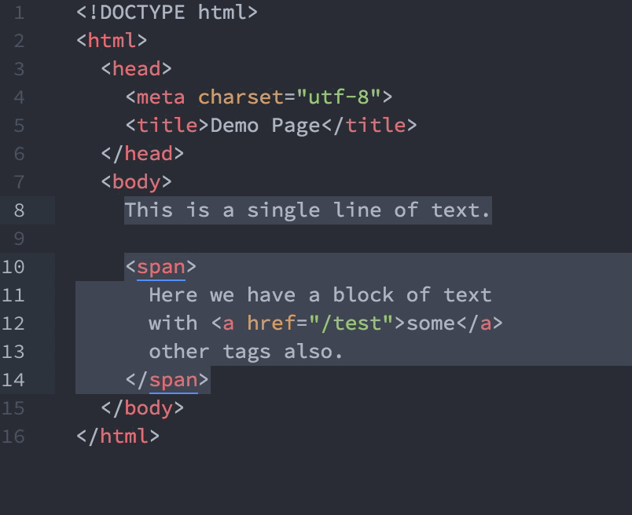

# Atom Tag Wrapper

An Atom package to enable wrapping of selection(s) in a tag.

Make one or more selections on your source code and hit <kbd>Alt</kbd> + <kbd>Shift</kbd> + <kbd>w</kbd> to wrap your selection(s) in a `
` tag. The inserted tags are selected automatically to enable easy typing of any other tag name.

